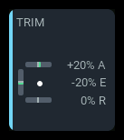
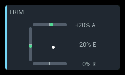

# `trim-panel`

Displays the radio's **effective trim positions**, including EdgeTX's
flight-mode trim inheritance. It is read-only: use the radio's trim controls
to change a trim. It needs no aircraft telemetry.

## Size examples

| 1x2 | 2x1 | 2x2 |
| --- | --- | --- |
|  |  |  |

Three-axis presentation with stored aileron/elevator/rudder trims +26/-26/0,
displayed as +20%/-20%/0% at standard range. Real EdgeTX simulator renders using
isolated firmware model settings, TX16S 480 x 272, Modern theme, outside the
menu overlay, with 10 px black padding. Spans mean columns x rows.
Supporting text is brighter for documentation; trim indicators are unchanged.
See [capture settings and regeneration](../developer-guide/build.md#component-screenshot-prototype).

## Three-axis presentation

The default `indicators: axes` arranges three equal-length bars around a square:
**aileron on top, elevator on the left, rudder on the bottom**. Throttle is
not shown. Each bar stops short of the corners, with equal eight-pixel end
insets where space allows.

Green fill extends **only from zero to the current value**, never from the
negative end of the range. Positive horizontal values fill right; negative
values fill left. Positive elevator fills upward; negative fills downward.
The fixed midpoint tick remains visible. At neutral it covers the one-pixel
minimum fill, so no green segment is visible. There is no moving endpoint tick.

A white dot plots the aileron/elevator position inside the square: aileron
moves it left/right, elevator moves it up/down. At neutral it rests at their
midpoint intersection. It is hidden if either source is unavailable.

The right-hand readouts identify each axis with a suffix:
`+20% A`, `0% E`, and `-15% R`. They align top/middle/bottom with their bars.
Their visible digit centers align vertically with the corresponding bar centers.

The square and readout column are centered **as one fixed-width group**.
The column reserves enough width for the axis suffix plus `-100%`, `-512`,
or `3P MID`. Numbers are right-aligned, and the column starts four pixels
beyond the horizontal bar ends. Changing digits never moves the square or
the column.

### Compact panels

Normal **1x1 cells retain all three readouts**, using a smaller font if needed.
Full captions may disappear, but the A/E/R suffixes still identify the axes.
Very short or narrow zones can shed readouts when three lines cannot fit;
the three bars remain. `readout: none` deliberately omits all readouts.
App mode's overlaid menu can further reduce space in the top-left cell.

Supported spans are `1x1` through `4x1`, `1x2` through `4x2`,
`2x3` through `4x3`, and `2x4` through `4x4`.

## Settings

| Key | Default | Meaning |
| --- | --- | --- |
| `indicators` | `axes` | `axes`, `single`, `pair`, or `all`. |
| `trim1` | `trim-ail` | Aileron in axes mode; first indicator otherwise. |
| `trim2` | `trim-ele` | Elevator in axes mode; second indicator otherwise. |
| `trim3` | `trim-thr` | Third indicator in `all`; unused in axes mode. |
| `trim4` | `trim-rud` | Rudder in axes mode; fourth indicator in `all`. |
| `scale` | `auto` | `standard`, `extended`, or `auto`; see below. |
| `readout` | `percent` | `percent`, `raw` (stored trim units), or `none`. |
| `orientation` | `auto` | For `single`, `pair`, and `all`: `auto`, `horizontal`, or `vertical`. |
| `orientation1` ... `orientation4` | empty | Per-indicator override for `single`, `pair`, and `all`: `horizontal` or `vertical`; empty follows the panel. |
| `label` | `TRIM` | Panel heading. |
| `accent` | `cyan` | Panel accent: `cyan`, `green`, `amber`, or `orange`. Axes-mode fills remain green. |

Source names are configurable and must resolve through EdgeTX. In axes mode,
the positions and A/E/R suffixes designate the configured sources' roles;
keep `trim1`, `trim2`, and `trim4` assigned to those axes. Orientation settings
do not change the fixed axes arrangement. Unknown settings are rejected at load.

## Scale and readout

EdgeTX returns eight times the stored trim value. Standard travel is
128 stored units in either direction (1024 from the source); extended travel
is 512 stored units (4096 from the source).

`readout: raw` shows stored units, not the eight-times source value.
`readout: percent` shows signed travel against the selected range, rounded
to a whole percent. Positive values have `+`, negatives have `-`, and neutral
is `0%`.

`scale: auto` starts with the standard range and switches permanently to
extended for that subscription after observing travel beyond the standard
range. EdgeTX does not expose the model's extended-trim setting to Lua.
Choose `extended` explicitly if percentages must use extended travel from
startup; choose `standard` to keep that scale and clamp bar fill at its ends.

A trim configured as a three-position toggle is detected after observing
both neutral and full deflection without an intermediate sample. It shows
`3P MID`, `3P HI`, or `3P LO` instead of a misleading percentage. This is a
behavioral inference, not firmware metadata: a standard trim observed only
at neutral and its end stop can look the same.

## Single, pair, and four-indicator layouts

`single` shows only `trim1`; `pair` shows `trim1` and `trim2`; `all` shows
all four configured sources, including throttle.

These modes use a repeated-indicator layout. Cells divide
the content along its longer dimension. With `orientation: auto`, bars are
vertical on taller panels and horizontal otherwise; per-indicator overrides
win over the panel setting. Captions derive from the source name (`trim-ail`
becomes `AIL`). Captions and readouts shed when their cells cannot fit text,
without dropping indicators.

## Unavailable sources

An unavailable trim shows `--` where there is room for a readout (`-- A`,
`-- E`, or `-- R` in axes mode) and a faint rather than green bar.
The whole panel shows an `N/A` badge only when none of its selected sources
is readable. Sources that resolve later are retried by the control service.

## Examples

The default three-axis panel:

```yaml
- id: trims
  type: trim-panel
  col: 0
  row: 0
  colSpan: 2
  rowSpan: 2
  config:
    indicators: axes
    readout: percent
    scale: auto
```

A compact three-axis panel with stored-unit readouts:

```yaml
- id: compact-trims
  type: trim-panel
  col: 1
  row: 1
  colSpan: 1
  rowSpan: 1
  config:
    indicators: axes
    readout: raw
```

A four-indicator arrangement:

```yaml
- id: all-trims
  type: trim-panel
  col: 0
  row: 0
  colSpan: 2
  rowSpan: 2
  config:
    indicators: all
    orientation: horizontal
    readout: percent
```
