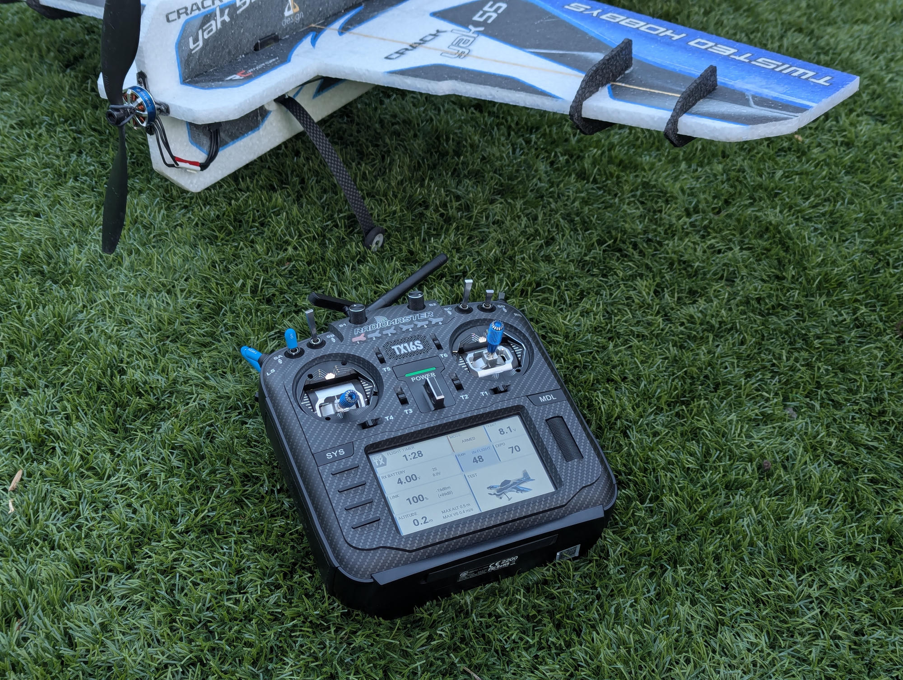
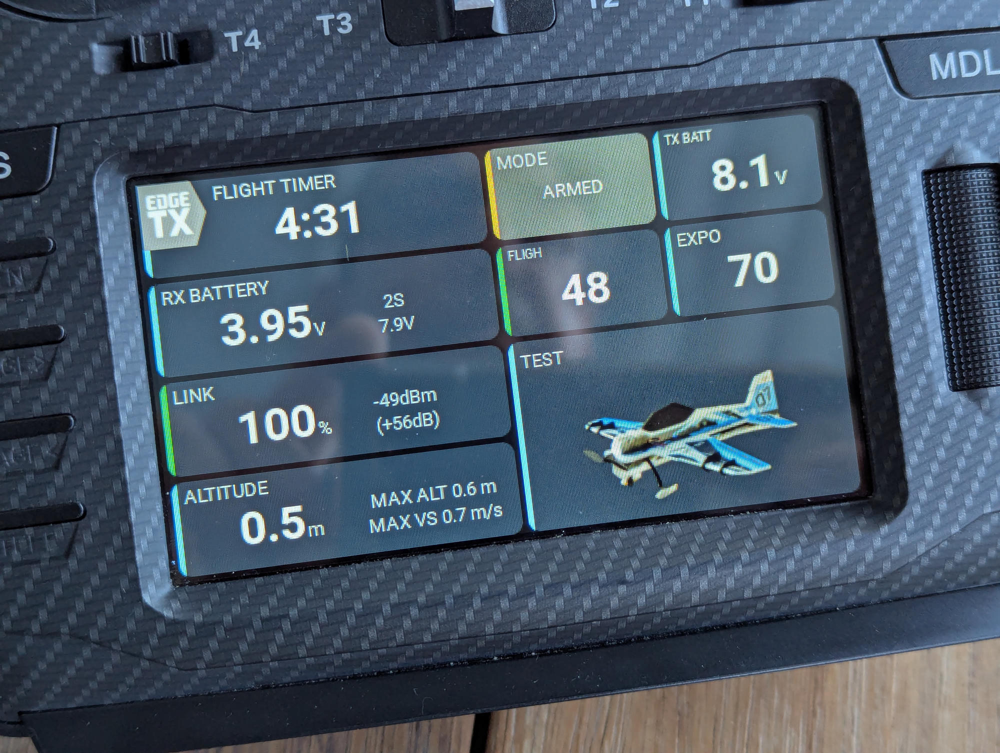
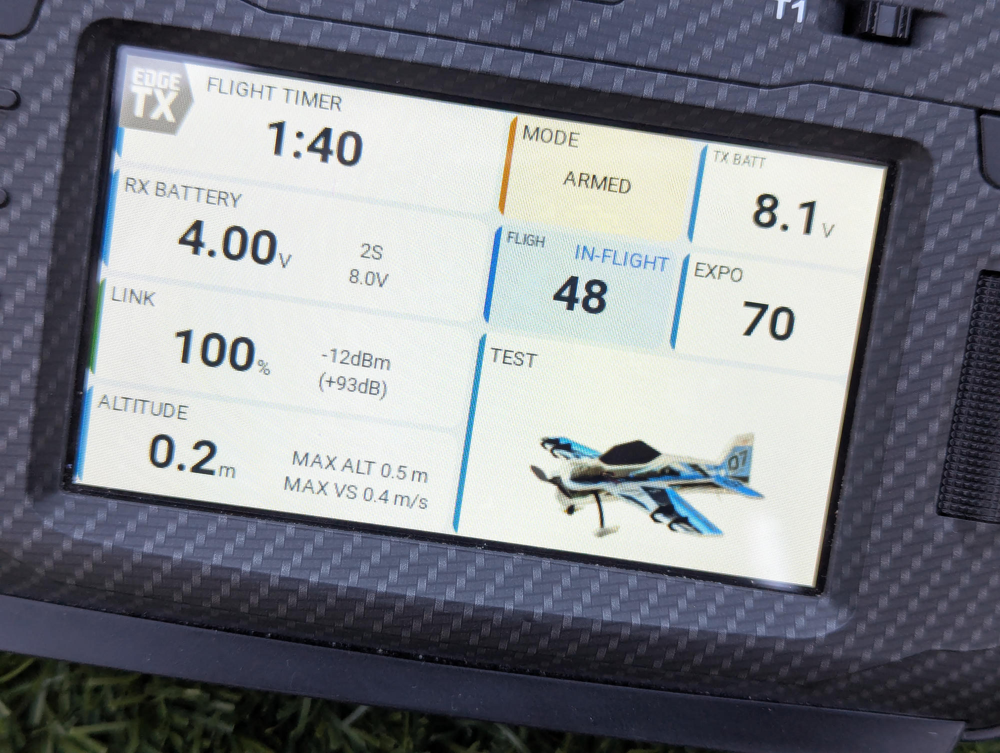

# AeroGrid

AeroGrid is a configurable 4 x 4 glass-cockpit dashboard for EdgeTX color radios.
YAML layouts combine telemetry, model timers, flight tracking, switch states,
trim positions, and model images in responsive panels.

  <figure>
    
    <figcaption>AeroGrid at the flying field.</figcaption>
  </figure>
  <figure>
    
    <figcaption>Modern Dark on a RadioMaster TX16S.</figcaption>
  </figure>
  <figure>
    
    <figcaption>Modern Light on the same radio.</figcaption>
  </figure>

## Why AeroGrid?

EdgeTX is an excellent foundation: open source, remarkably configurable, and
flexible enough to support a wide range of radios and aircraft. AeroGrid builds
on those strengths rather than replacing them.

The dashboard experience has not always matched that flexibility. Many widgets
have a dated appearance, and mixing widgets from different authors often means
mixing different fonts, colors, spacing, and alarm styles. Individually useful
widgets do not necessarily add up to a coherent interface.

Earlier graphics APIs made polished, consistent interfaces harder to build.
With LVGL, EdgeTX now offers a more flexible foundation for a shared UI design
system. Projects such as Kyle Stacy's
[KSE Dashboards for Rotorflight helicopters](https://github.com/kylestacy2/KSE-Dashboards)
show what focused dashboards can offer. For fixed-wing pilots, however, options
for a modern, cohesive dashboard that can be freely rearranged remain limited.

AeroGrid's goal is to provide **flexible, configurable, modern-looking dashboards
and panels**, with a consistent visual language throughout. Choose the information
that matters to your model, arrange it in a YAML-defined grid, and keep the same
typography, spacing, colors, and state indicators across the dashboard.
