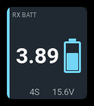
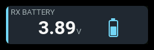
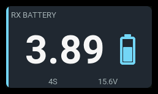

# `cell-battery`

| 1x2 | 2x1 | 2x2 |
| --- | --- | --- |
|  |  |  |

Displays an aircraft battery from either a **cells monitor** or a **pack-voltage
source**, such as `RxBt`. The source must actually measure the battery:
regulated receiver supply voltage does not reveal the flight pack's voltage.

The headline always shows two decimals. This is display precision, not a
promise of sensor accuracy or resolution. No remaining-capacity percentage is
inferred from voltage.

## Settings

| Setting | Default | Meaning |
| --- | --- | --- |
| `source` | `Cels` | Exact EdgeTX source name. A cells table in `cells` mode; a numeric voltage in `pack` mode. |
| `sourceType` | `cells` | `cells` or `pack`. The shape is explicit, never guessed from the value. |
| `reading` | `lowest` | `lowest`, `average`, or `pack` for a cells monitor; `average` or `pack` for a pack source. Pack mode must override the default. |
| `lowestSource` | empty | Optional independent numeric lowest-cell source, only in cells mode. |
| `cells` | `0` | In cells mode, `0` uses the measured count; a positive value specifies an expected count. In pack mode, a configured integer from 1 to 16 is mandatory. |
| `showCount` | `true` | Show measured count for a cells monitor, configured count for a pack source. |
| `showPack` | `true` | Show supporting pack voltage; when pack voltage leads, show average cell voltage instead. |
| `visual` | `battery` | `battery`, `bar`, or `none`. The upright battery sits beside the reading. Its fill measures voltage against the usable per-cell range, not remaining charge. |
| `cellEmpty` / `cellFull` | `3.3` / `4.2` | Usable range in volts per cell. |
| `warning` / `critical` | `3.5` / `3.3` | Low-voltage thresholds in volts per cell. |
| `label` / `accent` | `PACK` / `cyan` | Heading and semantic accent. |

Accent choices are `cyan`, `green`, `amber`, and `orange`. Unknown settings
are rejected at load. Pack mode also rejects a missing or invalid count,
`reading: lowest`, and a nonempty `lowestSource`.

Explicit `showCount: true` or `showPack: true` on a one-row panel requires `visual: none` and at least two columns; otherwise it is rejected.

## Behavior

For a cells monitor, use `sourceType: cells` and choose the lowest cell,
average cell, or total pack voltage with `reading`. Alarms always judge the
lowest cell. `cells: 0` follows the measured count; a configured expected
count highlights mismatches.

For a pack-voltage sensor, use `sourceType: pack` and set `cells` to the
actual series cell count. Choose pack or average cell voltage. Alarms judge
the average, which cannot reveal a weak or unbalanced cell.

Set `warning` and `critical` in **volts per cell** for either source type.
The battery or bar is empty at `cellEmpty` and full at `cellFull`, following
the selected reading's per-cell voltage. It indicates voltage, not remaining
charge.

## States

Thresholds are always **volts per cell**, including when total pack voltage
is the headline. In cells mode, an explicit `lowestSource` is used when
available, otherwise the lowest valid table entry. In pack mode, only the
derived average can be judged. `critical` is checked before `warning`.
The usable fill range and alarm thresholds are separate settings.

| State | Condition | Presentation |
| --- | --- | --- |
| `normal` | Valid, fresh voltage above the warning threshold | Reading and battery in their normal colors. |
| `warning` | Judged cell voltage at or below `warning` | Amber state color, tinted panel, `WARN` badge. |
| `critical` | Judged cell voltage at or below `critical` | Red state color, tinted panel, `CRIT` badge. |
| `stale` | A retained reading whose source is stale | Last voltage retained, muted presentation, `STALE` badge. |
| `unavailable` | No usable headline | `--`, no unit or battery glyph, `N/A` badge. |

When a supporting row is available, an empty cells table shows `NO CELLS`;
a numeric source incorrectly used as a cells monitor, or an unusable table,
shows `CELLS ERR`. Invalid pack voltage shows `VOLT ERR`. A source that has
not delivered data leaves the count row blank.

## Examples

Pack-voltage source:

```yaml
- id: flight-pack
  type: cell-battery
  col: 0
  row: 0
  colSpan: 2
  rowSpan: 2
  config:
    source: RxBt
    sourceType: pack
    cells: 4
    reading: pack
```

Cells-monitor source:

```yaml
- id: monitored-pack
  type: cell-battery
  col: 0
  row: 0
  colSpan: 2
  rowSpan: 2
  config:
    source: Cels
    sourceType: cells
    lowestSource: Cels-
    reading: lowest
    cells: 4
```
