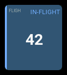
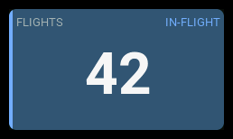

# `flight-counter`

| 1x2 | 2x1 | 2x2 |
| --- | --- | --- |
|  |  |  |

Counts qualifying flights, stores the total in GV9, and highlights an active flight.

## Settings

| Key | Default | Meaning |
| --- | --- | --- |
| `label` | `FLT` | Panel heading. |
| `armSwitch` | `SF^` | Armed switch position: `^` up, `-` middle, `v` down; or a logical switch such as `L01`. |
| `motorSource` | `ch3` | Motor output source. Set this to your model's actual throttle channel. |
| `motorReversed` | `false` | Reverse the motor source before measuring throttle percentage. |
| `minMotorPercent` | `25` | Motor must be strictly above this percentage of full travel, in `0..<100`. |
| `minFlightDuration` | `30` | Continuous qualification seconds, greater than 0 and at most 3600. |
| `disarmDuration` | `10` | Continuous disarming seconds to confirm the end, greater than 0 and at most 3600. |
| `announcements` | `false` | Play a start/end tone and speak the count. No external WAV files are needed. |
| `history` | `true` | Append confirmed completed flights to `/flights-history.csv`. |

The armed condition is configured on this panel only, independently of
`session.armSource`. For example, `armSwitch: "SA-"` arms in SA's middle position,
`"SF^"` in SF's up position, and `"SFv"` in its down position. `"L01"` arms while
logical switch 1 is true. Names are case-sensitive and resolved by EdgeTX;
nonexistent switches or positions produce a panel error.
If using session extrema or a separate Mode text panel, configure their armed
conditions to agree with this panel.
The motor source must also be radio-local, not a telemetry sensor.

## Behavior

A flight qualifies when the configured armed position, motor threshold, and
live telemetry hold continuously for `minFlightDuration`. Any interruption
before qualification resets the attempt. Qualification increments the total once.

After qualification, telemetry or motor changes **do not end the flight**.
Continuous disarming starts the end timeout. Re-arming before its expiry cancels
the pending end without incrementing again. An unavailable arm reading cannot
confirm disarming. A callback gap of more than one second restarts qualification
or a pending end timeout rather than assuming the condition held while unobserved.
Tracking continues while this dashboard is hidden, once the panel has loaded.

Reserve **GV9, flight mode 0**, with precision 0 and limits allowing `0..999`.
The existing total is kept, including one previously written by EdgeTX Flights.
Invalid, full, or unsavable counts produce a panel error rather than wrapping.

Use **one tracking panel across all dashboards for a model**, and do not
also run EdgeTX Flights. To show the total elsewhere, use a read-only `metric`
with source `gvar9`; configure other flight modes to inherit GV9 from FM0.

History is appended only after the end timeout confirms completion. It uses the
same five columns as the EdgeTX Flights history: `flight_date`, `model_name`,
`flight_count`, `duration`, and `model_id`, with CSV quoting for model names.
Duration runs from the start of qualification to the final disarming; the
disarm grace period is excluded. History does not restore or calculate GV9.
SD-card failures are shown as panel errors; the already saved count is retained.

GV9 persists through model saving and transmitter restarts, but in-flight
detection state does not. Changing model, reloading the dashboard, or restarting
the transmitter during a flight can lose its history and qualify it again.
Do not reload the tracking dashboard during flight.

## States

| Condition | Presentation |
| --- | --- |
| Resting or qualifying | Count, normal styling, no badge. |
| Qualified flight or pending disarm timeout | Count, mist blue surface, blue accent, `IN-FLIGHT` badge. |
| Confirmed completion | Count retained, normal styling restored. |
| GV9 unavailable | `--` and `N/A` badge. |
| Invalid configuration, persistence, or history failure | Panel error; tracking is disabled. |

If the selected theme cannot support a legible blue surface, the accent and
badge remain blue and the surface retains its normal color.

## Examples

Arms on SF's down position and counts flights once the motor and
telemetry have qualified for 30 seconds. Disarming for 10 seconds completes a flight.

```yaml
- id: flights
  type: flight-counter
  col: 0
  row: 0
  colSpan: 2
  rowSpan: 2
  config:
    label: Flights
    armSwitch: "SFv"
    motorSource: ch3
    minMotorPercent: 25
    minFlightDuration: 30
    disarmDuration: 10
    announcements: true
    history: true
```

The screenshots show count `42` in the active state using real EdgeTX rendering
with synthetic inputs. See [Panel screenshots](../developer-guide/build.md#panel-screenshots)
for the capture recipe and setup.
