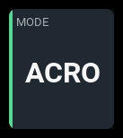
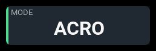
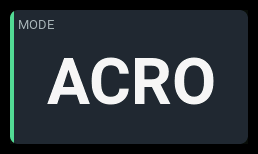

# `flight-mode`

| 1x2 | 2x1 | 2x2 |
| --- | --- | --- |
|  |  |  |

Shows the flight mode **the transmitter** is currently in, by name.

## Settings

| Key | Type | Default | Values | What it does |
| --- | --- | --- | --- | --- |
| `label` | string | `MODE` | any text | The panel's heading. The default is `MODE`; a single-cell header has room for about five characters, so `FLIGHT MODE` needs a wider panel. |
| `accent` | string | `green` | `cyan`, `green`, `amber`, `orange` | The stripe down the left edge. Green is the default because a flight mode is a statement of healthy current state, which is what the palette reserves green for. `cyan` is reserved for electrical readings, so prefer one of the other three. |
| `showIndex` | boolean | `false` | `true`, `false` | Adds a supporting row reading `#<n>`, where `<n>` is EdgeTX's flight mode number. **Needs a panel two rows tall.** On a single-row panel it is refused at load with the panel named, because no single row has space beneath the reading at any width. |

Anything else is rejected at load with the layout, panel and key named.

## Behavior

This is **EdgeTX's own flight mode** — one of the up-to-nine mixer modes
configured on the radio, each with its own trims and rates, usually selected
by a switch, and named in Model Setup. An unnamed mode shows as `FM0`, `FM1`,
and so on.

## States

This panel reaches two of the seven states.

| State | When | What you see |
| --- | --- | --- |
| `normal` | EdgeTX reports a flight mode, which is whenever the radio is on | The mode name in the reading colour, no badge |
| `unavailable` | Flight mode information is unavailable | `--` and an `N/A` badge |

It has no thresholds, so it never reaches `warning` or `critical`, and its
reading is radio-local rather than telemetry, so it never goes `stale`.

## Examples

```yaml
- id: mode
  type: flight-mode
  col: 0
  row: 0
  colSpan: 2
  rowSpan: 2
  config:
    label: MODE
    accent: green
    showIndex: true
```

The mode number is shown beneath the name as `#1`.
