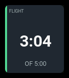
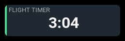
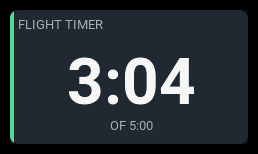

# `flight-timer`

| 1x2 | 2x1 | 2x2 |
| --- | --- | --- |
|  |  |  |

Shows one of the radio's own model timers.

## Settings

| Key | Type | Default | Values | What it does |
| --- | --- | --- | --- | --- |
| `timer` | number | `0` | `0`–`2` | Which model timer, counting from zero. |
| `label` | string | *(empty)* | any text | The panel's heading. **Empty means derive it**: the timer's own configured name, or `TIMER n` if it has none. |
| `accent` | string | `cyan` | `cyan`, `green`, `amber`, `orange` | The stripe down the left edge. |
| `warning` | number | — | seconds | Go amber at this many seconds. |
| `critical` | number | — | seconds | Go red at this many seconds. |

There is deliberately no direction setting: EdgeTX already says whether a
timer counts up or down, and the panel reads that rather than restating it.

**`warning` and `critical` are compared in the direction the timer runs.** A
countdown becomes critical at or below the threshold — it is running out. A
count-up timer becomes critical at or above it — it has run long. You give
the same number either way and the panel applies it the right way round.

## Behavior

The panel displays an **EdgeTX model timer**. Configure its name, start value,
activation mode or switch, and elapsed/remaining display in
**Model Setup → Timers** on the radio.

Select that timer with the panel's `timer` setting: `0` is Timer 1, `1` is
Timer 2, and `2` is Timer 3. The panel follows the timer's configured display.
Set `warning` and `critical` in the panel configuration to color the panel
at the desired time thresholds.

## States

| State | When | What you see |
| --- | --- | --- |
| `normal` | anything not below | the clock, no badge |
| `warning` | past `warning`, in the timer's own direction | amber tint, `WARN` badge |
| `critical` | past `critical`, or a countdown past zero | red tint, `CRIT` badge |
| `unavailable` | the timer is not configured | `--:--` and an `N/A` badge |

**A countdown past zero is always critical**, whatever the thresholds say. It
is the state most easily mistaken for a healthy timer — EdgeTX keeps counting
into negative numbers — so the panel shows a minus sign, turns red and says
so in words.

## Examples

A single cell. The clock and nothing else — no supporting row at this span,
so a countdown past zero shows only its minus sign and badge.

```yaml
- id: flight
  type: flight-timer
  col: 0
  row: 0
  colSpan: 1
  rowSpan: 1
  config:
    timer: 0
    label: FLIGHT
```

Two cells square, which is where everything appears: the largest clock, the
supporting row and the progress bar. Amber at a minute left, red at twenty
seconds.

```yaml
- id: glide
  type: flight-timer
  col: 0
  row: 0
  colSpan: 2
  rowSpan: 2
  config:
    timer: 1
    accent: green
    warning: 60
    critical: 20
```

No `label`, so the heading is the timer's own configured name.

A wide single row following the timer's configured display.

```yaml
- id: airborne
  type: flight-timer
  col: 0
  row: 0
  colSpan: 4
  rowSpan: 1
  config:
    timer: 0
    label: AIRBORNE
```
