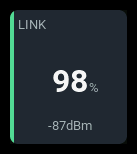
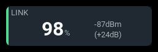
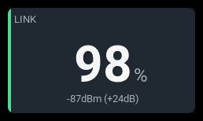

# `link-status`

| 1x2 | 2x1 | 2x2 |
| --- | --- | --- |
|  |  |  |

Shows measured link quality or RSSI, link freshness, and optional RF details.
Link quality is never inferred from RSSI. The panel does not calculate an
aggregate health percentage or issue voice/haptic alerts.

## Settings

| Key | Default | Meaning |
| --- | --- | --- |
| `qualitySource` | empty | Exact link-quality source name, usually receiver-side `RQly` for ELRS. |
| `rssiSource` | `RSSI` | Exact signal-strength source name; ELRS receiver examples use `1RSS`. |
| `reading` | `auto` | `quality`, `rssi`, or `auto`, which prefers available quality and falls back to RSSI. |
| `protocol` | `generic` | `generic` preserves source units and raw RFMD; `elrs4` enables ELRS 4.x rate and nominal sensitivity mapping. |
| `modeSource` | empty | Optional RFMD source. Required for automatic ELRS margin. |
| `snrSource` | empty | Optional signal-to-noise source, usually `RSNR`. |
| `powerSource` | empty | Optional transmit-power source, usually `TPWR`. |
| `qualityWarning` / `qualityCritical` | none | Independent low-LQ thresholds, in percent from 0 to 100. Require `qualitySource`. |
| `marginWarning` / `marginCritical` | none | Low RSSI-margin thresholds, in dB. Require `elrs4`, RSSI, and mode sources. |
| `rssiWarning` / `rssiCritical` | none | Independent low-RSSI thresholds in the RSSI source's numerical units. |
| `barMin` / `barMax` | `0` / `100` | Primary-reading values corresponding to empty/full bar. |
| `visual` | `bar` | `bar` or `none`. |
| `extrema` | `none` | `none`, EdgeTX minimum `source`, or flight-session minimum `flight`. |
| `extremaSource` | empty | Explicit minimum source; otherwise source mode uses the leading source's `-` suffix. |
| `label` | `LINK` | Panel heading. |
| `accent` | `green` | Normal accent: `green`, `cyan`, `amber`, or `orange`. |

Source names are case-sensitive. Unknown settings are rejected at load.
Critical thresholds must be less than or equal to their warning thresholds.
No alarm thresholds are supplied by default.

## Behavior

Choose link quality or RSSI as the main reading; `reading: auto` prefers
available quality. Use receiver-side sources such as `RQly`, `1RSS`, and
`RSNR`. Link quality shows packet reception; RSSI shows signal strength,
with less-negative dBm values indicating a stronger signal.

For ELRS 4.x, set `protocol: elrs4` and configure RSSI and mode sources to
show the RF rate and estimated signal margin. Margin is headroom above
nominal receiver sensitivity, not a guaranteed failsafe boundary.
Dual-band modes and unavailable or stale inputs show no margin. Use
`generic` for other protocols, including ELRS 3.x.

Configure quality, RSSI, or margin thresholds as needed; none are set by
default. The most severe live alarm wins. Optional SNR and power readings
provide context without triggering alarms.

## States

The most severe configured **live** threshold condition wins. Comparisons
include the boundary: a value equal to warning or critical triggers that state.
Equal-severity conditions prefer RSSI, then LQ, then margin.
Link-down takes precedence over threshold alarms.

| Condition | Presentation |
| --- | --- |
| Live readings, no crossed thresholds | Measured value, normal accent. |
| Low LQ, RSSI or margin | `WARN`/`CRIT`, state color, explicit cause where supporting text fits. |
| Link down after receiving data | `NO LINK` headline without a unit, critical state, empty bar. Supporting stale readings carry `*`. |
| Stale primary source | Last reading retained, `STALE`; an independent live critical/warning condition can take precedence. |
| Source not recognized | `N/A` reading and badge. |
| Source waiting for data | `--` reading and `N/A` badge. |
| Valid zero while live | Measured zero, not an unavailable sentinel. |

## Examples

ELRS quality with automatic margin and optional details:

```yaml
- id: receiver-link
  type: link-status
  col: 0
  row: 0
  colSpan: 2
  rowSpan: 3
  config:
    protocol: elrs4
    reading: quality
    qualitySource: RQly
    rssiSource: 1RSS
    modeSource: RFMD
    snrSource: RSNR
    powerSource: TPWR
```

Compact LQ with RSSI/margin stacked on the right and no bottom bar:

```yaml
- id: compact-link
  type: link-status
  col: 0
  row: 0
  colSpan: 2
  rowSpan: 1
  config:
    protocol: elrs4
    reading: quality
    qualitySource: RQly
    rssiSource: 1RSS
    modeSource: RFMD
    visual: none
```

Generic RSSI with a source-unit bar and EdgeTX minimum:

```yaml
- id: signal
  type: link-status
  col: 0
  row: 0
  colSpan: 2
  rowSpan: 2
  config:
    reading: rssi
    rssiSource: RSSI
    barMin: 0
    barMax: 100
    extrema: source
```

Select alarm thresholds for the actual receiver, protocol, rate and operating
conditions. See [ELRS signal health](https://www.expresslrs.org/info/signal-health/),
the [RFMD enumeration](https://github.com/ExpressLRS/ExpressLRS/blob/4.1.0/src/include/common.h)
and [nominal sensitivity tables](https://github.com/ExpressLRS/ExpressLRS/blob/4.1.0/src/src/common.cpp).
