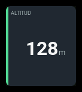
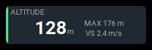
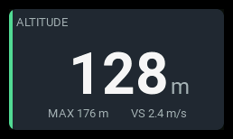

# `metric`

| 1x2 | 2x1 | 2x2 |
| --- | --- | --- |
|  |  |  |

Displays one to three independently configured numeric EdgeTX sources.
The first reading is the headline; the other two are supporting readings.
Sensor minimum and maximum readings are ordinary sources, such as `GAlt-`
and `GAlt+`. The panel does not derive measurements or convert units.

## Settings

| Key | Default | Meaning |
| --- | --- | --- |
| `metrics` | required | Ordered list of one to three numeric readings. |
| `accent` | `cyan` | Normal accent: `cyan`, `green`, `amber`, or `orange`. |
| `visual` | `bar` | `bar`, `radial`, or `none`. |

Normal visuals use the configured accent; alarm and stale states use the
shared state color.

### Metrics

Configure an ordered `metrics` list with one to three entries:

| Entry key | Default | Meaning |
| --- | --- | --- |
| `source` | required | Exact, case-sensitive numeric EdgeTX source name. |
| `label` | source name | Panel heading for the first entry; caption for supporting entries. |
| `unit` | sensor unit | Display-unit override. An explicit empty string hides the unit. No numerical conversion is performed. |
| `precision` | sensor precision | Fixed decimal places, an integer from 0 to 3. |
| `rangeMin` / `rangeMax` | `0` / `100` | Values corresponding to empty/full visualization. |
| `warning` / `critical` | none | Thresholds in this source's numerical units. |
| `direction` | `auto` | `rising`, `falling`, or `auto`. Auto infers falling only when both thresholds are present and critical is below warning. |

## Behavior

The first metric is the main reading; the others show their captions and
values. Each has its own unit and precision. Missing readings show `--`.

Only the primary metric drives the bar or radial and the panel alarm state.
The bar or radial is empty at `rangeMin` and full at `rangeMax`.
Values outside that range keep the visual empty or full, but the numerical
reading still shows the actual value.

Set thresholds on the first metric to enable alarms, and use `direction`
to choose rising or falling comparisons. Thresholds include the boundary,
with critical taking priority. Supporting metrics do not trigger alarms.

## States

| Condition | Presentation |
| --- | --- |
| Live primary, no crossed thresholds | Value and normal accent. |
| Primary crosses warning or critical | `WARN` or `CRIT` badge and state color. |
| Primary becomes stale | Last value retained, `STALE` badge and muted presentation. |
| Primary unavailable | `--`, `N/A` badge, no unit beside the sentinel. |
| Supporting source unavailable | Its caption followed by `--`, without a unit. |
| Supporting source stale | Last value retained; it does not change the primary state. |

## Examples

Altitude, EdgeTX maximum, and vertical speed:

```yaml
- id: altitude
  type: metric
  col: 0
  row: 0
  colSpan: 2
  rowSpan: 2
  config:
    metrics:
      - source: GAlt
        label: ALT
        unit: m
        precision: 0
        rangeMin: 0
        rangeMax: 400
        direction: rising
        warning: 300
        critical: 400
      - source: GAlt+
        label: MAX
        unit: m
        precision: 0
      - source: VSpd
        label: VS
        unit: m/s
        precision: 1
    accent: green
```

Compact voltage with independently configured current and altitude readings:

```yaml
- id: power
  type: metric
  col: 0
  row: 1
  colSpan: 2
  rowSpan: 1
  config:
    metrics:
      - source: RxBt
        label: VOLTAGE
        precision: 1
        direction: falling
        warning: 22
        critical: 20
      - source: Curr
        label: CUR
        precision: 1
      - source: GAlt
        label: ALT
        precision: 0
    visual: none
```

Use thresholds appropriate to the actual source. `RxBt` may measure a
regulated receiver supply rather than the flight pack.

A global variable through the ordinary EdgeTX source interface:

```yaml
- id: gain
  type: metric
  col: 1
  row: 1
  colSpan: 1
  rowSpan: 1
  config:
    metrics:
      - source: gvar1
        label: GV1
        unit: ""
        precision: 1
    visual: none
```

Global variable readings follow the active flight mode. Configure their label,
unit, precision, and visualization range explicitly. `precision: 1` displays
one decimal place.
