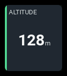
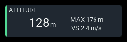
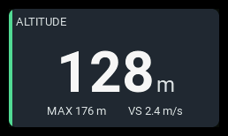
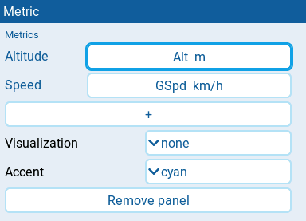
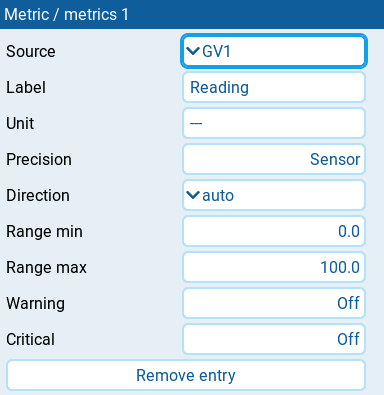

# Metric

| 1x2 | 2x1 | 2x2 |
| --- | --- | --- |
|  |  |  |

Displays up to three independently configured numeric EdgeTX sources.
The first reading is the headline; the other two are supporting readings.
Sensor minimum and maximum readings are ordinary sources, such as `GAlt-`
and `GAlt+`. The panel does not derive measurements or convert units.

## Settings

| Setting | Default | What it does |
| --- | --- | --- |
| **Metrics** | none | Up to three readings. The first is the headline; the others are supporting readings. Each row shows the entry's label (or source) and a summary; unnamed readings use **Metric 1**, **Metric 2**, and so on. Tap **+** to add a reading; the first one starts blank, later ones copy the last entry. |
| **Visualization** | none | How the headline reading is drawn: **bar**, **radial**, or **none**. |
| **Accent** | cyan | Color used for the normal state: **cyan**, **green**, **amber**, or **orange**. Alarm and stale states use the shared state colors instead. |

### Metric entry

Tap a reading under **Metrics** to open its settings.

| Setting | Default | What it does |
| --- | --- | --- |
| **Label** | source name | Panel heading for the headline reading; caption for supporting readings. Clear it to use the source name. |
| **Source** | required | The EdgeTX numeric source to show: a telemetry sensor, its minimum or maximum (for example `GAlt-` or `GAlt+`), a global variable, a channel, and so on. |
| **Unit** | sensor unit | Unit text shown beside the value. It only changes the label, not the number. Clear it to use the sensor's unit. |
| **Precision** | Sensor | Decimal places, 0 to 3. Step below 0 to reach **Sensor**, which uses the precision EdgeTX reports for the source. |
| **Direction** | auto | Whether alarms trigger when the value climbs (**rising**) or drops (**falling**). **auto** treats the reading as falling only when both thresholds are set and **Critical** is below **Warning**. |
| **Range min** | 0 | Low end of the reading's scale: the bar or radial is empty here, and **Warning** and **Critical** cannot go below it. Steps of 0.1. |
| **Range max** | 100 | High end of the reading's scale: the bar or radial is full here, and **Warning** and **Critical** cannot go above it. Steps of 0.1. |
| **Warning** | Off | Value that triggers the warning state, in the source's units, between **Range min** and **Range max**. Steps of 0.1. One step below **Range min** is **Off**. |
| **Critical** | Off | Value that triggers the critical state, in the source's units, between **Range min** and **Range max**. Steps of 0.1. One step below **Range min** is **Off**. |
| **Remove entry** | | Deletes this reading. |

## Behavior

The first metric is the main reading; the others show their captions and
values. Each has its own unit and precision. Missing readings show `--`.
When a headline unit is visible, the number and unit are centered together.
New Metric panels inherit the selected sensor's unit. Enlarging a compact panel
reveals the unit when it fits.

Only the headline reading drives the bar or radial and the panel alarm
state. The bar or radial is empty at **Range min** and full at **Range max**.
Values outside that range keep the visual empty or full, but the number
still shows the actual value.

Set **Warning** or **Critical** on the headline reading to enable alarms.
Thresholds include the boundary value, and critical takes priority. A
threshold only counts inside the range, so set **Range min** and **Range max**
to cover your alarm values even when **Visualization** is **none**. Narrowing
the range past a threshold turns that threshold **Off**.
**Direction**, the range, and the thresholds appear on supporting readings
too, but have no effect there.

## States

| Condition | Presentation |
| --- | --- |
| Live primary, no crossed thresholds | Value and normal accent. |
| Primary crosses warning or critical | `WARN` or `CRIT` badge and state color. |
| Primary becomes stale | Last value retained, `STALE` badge and muted presentation. |
| No metric, or no source picked | `METRIC` heading and `--`. |
| Primary unavailable | `--`, `N/A` badge, no unit beside the sentinel. |
| Supporting source unavailable | Its caption followed by `--`, without a unit. |
| Supporting source stale | Last value retained; it does not change the primary state. |
