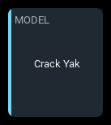
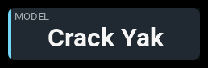
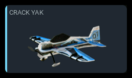

# `model-identity`

| 1x2 | 2x1 | 2x2 |
| --- | --- | --- |
|  |  |  |

Shows which model is loaded: its name, the picture you assigned it, or both.

## Settings

| Key | Type | Default | Values | What it does |
| --- | --- | --- | --- | --- |
| `presentation` | string | `auto` | `auto`, `name`, `image`, `both` | Which arrangement to draw. `auto` shows the name alone on a panel smaller than four cells and the picture on anything larger. `image` and `both` show a picture with the name in the heading. |
| `label` | string | `MODEL` | any text | The panel's heading — **only where no picture is drawn**. With a picture the model name takes the heading, so a label set alongside `presentation: image` or `both` is refused at load with the panel named. |
| `accent` | string | `cyan` | `cyan`, `green`, `amber`, `orange` | The stripe down the left edge. |
| `showLabels` | boolean | `false` | `true`, `false` | Adds a supporting row listing the model's configured labels. **Needs a panel two rows tall**; on a single row it is refused at load with the panel named. |

Anything else is rejected at load with the layout, panel and key named.

## Behavior

Assign the model name and picture in EdgeTX Model Setup. Choose `name`,
`image`, or `both`; `auto` shows the name on small panels and the picture
on larger ones.

With a picture, the model name becomes the heading and the whole picture
fits without cropping. Without a picture, `label` is the heading and the
model name is the main reading. Long names may extend beyond a narrow panel.

A missing picture falls back to the name. An unreadable picture may leave
image-only mode empty; use `both` to keep the name visible.

## States

This panel reaches two of the seven states.

| State | When | What you see |
| --- | --- | --- |
| `normal` | The model's identity is readable, which is whenever the radio is on | The name in the reading colour, no badge |
| `unavailable` | Model information is unavailable | `--` and an `N/A` badge |

It has no thresholds, so it never reaches `warning` or `critical`, and its
reading comes from the radio rather than from telemetry, so it never goes
`stale`.

## Examples

A single cell, which is the name by itself. Nothing else fits, and this is the
span where a long name overhangs furthest relative to the panel.

```yaml
- id: identity
  type: model-identity
  col: 0
  row: 0
  colSpan: 1
  rowSpan: 1
  config:
    label: MODEL
```

A picture with the model name and labels.

```yaml
- id: identity-tall
  type: model-identity
  col: 0
  row: 0
  colSpan: 2
  rowSpan: 3
  config:
    accent: green
    presentation: both
    showLabels: true
```

No `label` here, and it would be refused: a panel showing the picture puts
the model name in the heading, so a configured label has nowhere to go.

A wide single row showing the name alone. This is the arrangement that holds
the longest model name EdgeTX will store without overhanging the panel.

```yaml
- id: identity-wide
  type: model-identity
  col: 0
  row: 0
  colSpan: 4
  rowSpan: 1
  config:
    label: MODEL
    presentation: name
```
