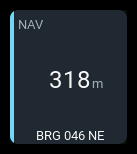
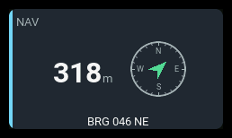

# `navigation`

| 1x2 | 2x1 | 2x2 |
| --- | --- | --- |
|  |  |  |

Shows the aircraft's GPS location, distance from home, and **north-up bearing
from home toward the model**. The arrow is not aircraft heading, transmitter
orientation, or a return-home instruction.

The GPS source supplies model coordinates and the pilot/home coordinates
recorded by EdgeTX. AeroGrid does not set or reset home.

## Settings

| Key | Default | Meaning |
| --- | --- | --- |
| `source` | `GPS` | Exact EdgeTX GPS source name; must return a coordinate table. |
| `presentation` | `auto` | `distance`, `bearing`, `compass`, `detailed`, or `auto`. |
| `bearingFormat` | `degrees` | Numeric azimuth or `quadrant` notation. |
| `showBearing` | presentation default | Independently show or hide the bearing text row. |
| `showCoordinates` | presentation default | Independently show or hide the latitude/longitude row. |
| `warning` / `critical` | none | Distance thresholds in metres, counting upward. |
| `label` | `NAV` | Panel heading. |
| `accent` | `cyan` | Panel accent: `cyan`, `green`, `amber`, or `orange`. |

Unknown settings are rejected at load. Source names are case-sensitive.

## Behavior

Distance from home is always the main reading, using the configured GPS
source. Home is the position recorded by EdgeTX.

Choose `distance`, `bearing`, `compass`, or `detailed` to add bearing,
a compass, or coordinates. `auto` adds detail as panel size allows.
`showBearing` and `showCoordinates` override the text choices.

The north-up arrow points from home toward the model and disappears when
bearing is unavailable. Choose degrees or quadrant notation, such as
`N29°E`, with `bearingFormat`. Coordinates show the model's latitude and
longitude. Set distance thresholds in metres if needed.

## States

Warning and critical thresholds are always metres, including when the
display uses kilometres. Critical is checked before warning.

| Condition | Presentation |
| --- | --- |
| Valid fix and home | Distance, live bearing, and requested coordinates. |
| No recognized GPS source | `--`, `N/A` badge, `NO GPS SOURCE` or a shorter form where a footer fits. |
| Source present but no fix | `--`, `N/A` badge, `NO FIX` where a footer fits. |
| Valid fix but no home | No distance or bearing; coordinates remain available. `NO HOME POSITION` or a shorter form, no failure badge. |
| Stale position | Last reading retained, `STALE` badge, `LAST KNOWN` or `LAST` where a footer fits. |
| Distance at or above warning/critical | Amber/red state presentation and `WARN`/`CRIT` badge. |

Zero latitude and longitude together are treated as no fix, matching
EdgeTX's uninitialized GPS values. A valid `0m` reading means the model is
at home, not that GPS is unavailable.

## Examples

A compass with quadrant bearing and no coordinates:

```yaml
- id: location
  type: navigation
  col: 0
  row: 0
  colSpan: 2
  rowSpan: 2
  config:
    presentation: compass
    bearingFormat: quadrant
    warning: 500
    critical: 1000
```

Coordinates without bearing text, retaining the compass:

```yaml
- id: position
  type: navigation
  col: 0
  row: 0
  colSpan: 2
  rowSpan: 2
  config:
    presentation: compass
    showBearing: false
    showCoordinates: true
```

Both text rows without a compass:

```yaml
- id: position-text
  type: navigation
  col: 0
  row: 0
  colSpan: 2
  rowSpan: 2
  config:
    presentation: bearing
    showCoordinates: true
```
