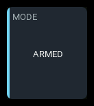
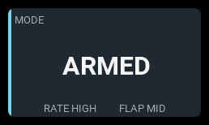

# `state`

| 1x2 | 2x1 | 2x2 |
| --- | --- | --- |
|  |  |  |

Displays one to three readings selected by physical or logical switch conditions. Select
**State** in the editor and use `type: state` in layouts.
The first entry is the main reading; the others are supporting readings.

## Settings

| Key | Default | Meaning |
| --- | --- | --- |
| `entries` | one entry with three SA positions | Ordered list of one to three entries. |
| `accent` | `cyan` | Normal accent: `cyan`, `green`, `amber`, or `orange`. |

Each entry has these settings:

| Entry key | Default | Meaning |
| --- | --- | --- |
| `label` | required | Main heading or supporting caption. |
| `states` | required | Ordered list of one to three conditions. |

Each state has these settings:

| State key | Default | Meaning |
| --- | --- | --- |
| `switch` | required | **When**: physical position such as `SF^`, `SA-`, or `SFv`, or logical switch such as `L01`. |
| `text` | required | Exact text displayed when this condition wins. |
| `background` | `normal` | Main entry's panel mode: `normal`, `active`, `warning`, or `critical`. Supporting entries do not control the panel mode. |

Labels and mapped texts must be nonempty single-line strings. Quote texts
that YAML could interpret as numbers or booleans, such as `"ON"` and `"OFF"`.

## Behavior

Conditions are evaluated in insertion order. The first true condition wins.
An unavailable earlier condition stops evaluation rather than silently falling
through. If none matches, the entry is unmapped; it never retains the previous state.

In the editor, open an entry, then tap a state to edit **When**, **Text**, and
**Background**. New states append at the bottom. To change priority, delete a
state and recreate it at the bottom; there are no reorder controls. An entry
must retain at least one state and can hold at most three.

Switch readings work without receiver telemetry. They describe transmitter
switch positions, not confirmed aircraft state. Texts such as `ARMED` are
your own labels: verify their relationship to your model's configuration.
No text implies an alarm color. The main entry's winning `background` selects
the entire panel's shared presentation: panel surface, sidebar, text colors,
and badge. `active` uses the same blue presentation and `IN-FLIGHT` badge as
the flight counter; `warning` and `critical` use their shared colors without
displaying `WARN` or `CRIT` badges.
`normal` restores the configured accent and normal surface. An unavailable
or unmapped main entry clears the mode and uses the unavailable presentation.
Supporting entries update their own readings but never override the panel mode,
even when their conditions specify a different `background`.

Supporting captions and texts appear below the main reading or in a compact
side stack when there is room. They are hidden when they cannot fit intact.
Text is never shortened to suggest a different switch state.

## States

| Condition | Presentation |
| --- | --- |
| First true main condition | Exact configured text and its whole-panel mode. |
| Earlier main condition unknown or unavailable | `--` and `N/A` badge, with no background. |
| No condition matches | `UNMAPPED` (or `?` in a narrow reading slot) and `N/A` badge. |
| Configured main text cannot fit even at the smallest font | `NO FIT` and `N/A` badge; widen the panel or shorten the configured texts. |
| Supporting source unavailable or unmapped | Caption with `--` (unavailable) or `?` (unmapped); main state is unchanged. |
| Invalid configuration | Layout diagnostic rather than an inferred mode. |

## Examples

A two-position switch and two supporting three-position switches:

```yaml
- id: switch-state
  type: state
  col: 0
  row: 0
  colSpan: 2
  rowSpan: 2
  config:
    accent: green
    entries:
      - label: MODE
        states:
          - switch: SF^
            text: DISARMED
          - switch: SFv
            text: ARMED
            background: active
      - label: RATE
        states:
          - switch: SA^
            text: LOW
          - switch: SA-
            text: MEDIUM
          - switch: SAv
            text: HIGH
      - label: FLAP
        states:
          - switch: SB^
            text: RETRACT
          - switch: SB-
            text: TAKEOFF
          - switch: SBv
            text: LAND
            background: warning
```

Use only the first entry for a single reading, or omit the third for two.
Choose switches and texts appropriate to your radio and model.
