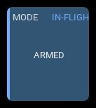
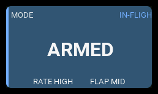
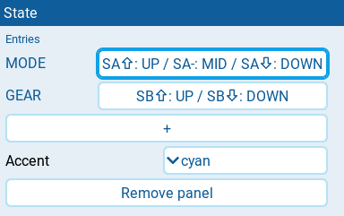
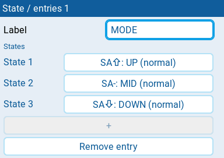
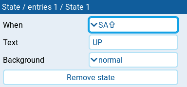

# State

| 1x2 | 2x1 | 2x2 |
| --- | --- | --- |
|  |  |  |

Displays one to three readings selected by physical or logical switch conditions.
The first entry is the main reading; the others are supporting readings.
Switch positions describe transmitter controls, not confirmed aircraft state.

## Settings

| Setting | Default | What it does |
| --- | --- | --- |
| **Entries** | one entry, `SW1` | One to three readings. The first is the headline; the others are supporting readings. Each row shows its label and a summary of its conditions. Tap **+** to copy the last entry, including its states. |
| **Accent** | cyan | Color used for the normal state: **cyan**, **green**, **amber**, or **orange**. The main entry's winning **Background** can override it. |
| **Remove panel** | | Deletes the panel from the screen. |

### State entry

Tap a reading under **Entries** to open its settings.

| Setting | Default | What it does |
| --- | --- | --- |
| **Label** | `SW1` | Panel heading for the main reading; caption for supporting readings. Required, nonempty single-line text. New entries copy the last entry's label. |
| **States** | three SA positions | One to three ordered conditions. The initial entry maps `SA^` to `UP`, `SA-` to `MID`, and `SAv` to `DOWN`. Tap **+** to append a state with **When** set to `SA^` and **Text** set to `UP`, rather than copying the last state. |
| **Remove entry** | | Deletes this reading. At least one entry must remain. |

### State condition

Tap a condition under **States** to open its settings.

| Setting | Default | What it does |
| --- | --- | --- |
| **When** | `SA^` for a new state | Physical switch position, such as `SF^`, `SA-`, or `SFv`, or logical switch, such as `L01`. The first true condition wins. |
| **Text** | `UP` for a new state | Exact text displayed when this condition wins. Required, nonempty single-line text. |
| **Background** | normal | Main entry's whole-panel presentation: **normal**, **active**, **warning**, or **critical**. Supporting entries do not control the panel presentation. |
| **Remove state** | | Deletes this condition. At least one state must remain in the entry. |

## Behavior

Conditions are evaluated in insertion order. The first true condition wins.
An unknown, unavailable, or stale earlier condition stops evaluation rather
than silently falling through. If none matches, the entry is unmapped; it
never retains the previous state. New states append at the bottom. To change
priority, delete a state and recreate it at the bottom; there are no reorder
controls.

Switch readings work without receiver telemetry. Texts such as `ARMED` are
your own labels: verify their relationship to your model's configuration.
No text implies an alarm color. The main entry's winning **Background** selects
the entire panel's shared presentation: panel surface, sidebar, text colors,
and badge. **active** uses the same blue presentation and `IN-FLIGHT` badge as
the flight counter; **warning** and **critical** use their shared colors without
displaying `WARN` or `CRIT` badges.
**normal** restores the configured **Accent** and normal surface. An unavailable
or unmapped main entry clears the mode and uses the unavailable presentation.
Supporting entries update their own readings but never override the panel mode,
even when their conditions specify a different **Background**.

Supporting captions and texts appear below the main reading or in a compact
side stack when there is room. They are hidden when they cannot fit intact.
Text is never shortened to suggest a different switch state. Space is reserved
for the widest configured text, not just the currently selected one.

## States

| Condition | Presentation |
| --- | --- |
| First true main condition | Exact configured **Text** and its whole-panel **Background**. |
| Earlier main condition unknown, unavailable, or stale | `--` and `N/A` badge, with no active or alarm background. |
| No main condition matches | `UNMAPPED` (or `?` in a narrow reading slot) and `N/A` badge. |
| A configured main text cannot fit even at the smallest font | `NO FIT` and `N/A` badge; widen the panel or shorten the configured texts. |
| Supporting condition unavailable or unmapped | Caption with `--` (unavailable) or `?` (unmapped); main state is unchanged. |
| Invalid configuration | Layout diagnostic rather than an inferred mode. |
