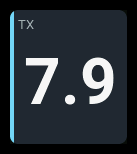
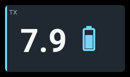

# `tx-battery`

| 1x2 | 2x1 | 2x2 |
| --- | --- | --- |
|  |  |  |

Shows the **transmitter's own** battery voltage — the pack inside the radio in
your hands, not anything on the aircraft.

## Settings

| Key | Type | Default | Values | What it does |
| --- | --- | --- | --- | --- |
| `label` | string | `TX` | any text | The panel's heading. The default is `TX`; a single-cell header has room for about five characters, so `TX BATTERY` needs a wider panel. |
| `accent` | string | `cyan` | `cyan`, `green`, `amber`, `orange` | The stripe down the left edge. Cyan because the palette reserves it for electrical data, and this is a battery. |
| `packEmpty` | number | *the radio's* | volts | Overrides the empty end of the radio's battery meter range. |
| `packFull` | number | *the radio's* | volts | Overrides the full end. |
| `warning` | number | *none* | volts | At or below this, the panel goes `warning`. |
| `critical` | number | *none* | volts | At or below this, the panel goes `critical`. |
| `visual` | string | `battery` | `battery`, `bar`, `none` | How the estimate is drawn. See below. |
| `showPercent` | boolean | `false` | `true`, `false` | Whether the estimate is also written as a percentage. |

Anything else is rejected at load with the layout, panel and key named.

## Behavior

The battery fill and optional `EST` percentage use the range set in
**SYS → Hardware → Battery meter range**. To override it, set both `packEmpty`
and `packFull`, with full above empty. Incomplete or invalid overrides use
the radio's range. If no range is available, only voltage is shown.

The fill and percentage estimate voltage headroom, not remaining charge.
Choose `visual: battery`, `bar`, or `none`; enable `showPercent` to display
the estimate as text.

Set `warning` and `critical` to voltages appropriate for your pack, with
critical below warning. The panel changes color at or below each threshold,
with critical taking priority. No thresholds are set by default.

## States

| State | When | What you see |
| --- | --- | --- |
| `normal` | A voltage above `warning`, or no thresholds stated | The voltage in the reading colour, the whole cell in the accent, no badge |
| `warning` | Voltage at or below `warning` | Amber accent, tinted panel, amber cell, `WARN` badge |
| `critical` | Voltage at or below `critical` | Red accent, tinted panel, red cell throughout, `CRIT` badge |
| `stale` | The radio stopped answering; the last voltage is kept | Muted reading, `STALE` badge |
| `unavailable` | No voltage has ever been read | `--` and an `N/A` badge |

## Examples

```yaml
- id: tx
  type: tx-battery
  col: 0
  row: 0
  colSpan: 2
  rowSpan: 2
  config:
    label: TX
    accent: cyan
    warning: 6.7
    critical: 6.5
    visual: battery
    showPercent: true
```

The voltage appears beside an upright battery, with the percentage beneath
the voltage. No range is stated, so it uses whatever your radio's
battery meter is set to — which is the normal case. Add `packEmpty` and
`packFull` only if you want to override that.
