# Add, configure and edit a dashboard

Add AeroGrid to a radio screen, choose a layout, then customize it on the radio.
Install [AeroGrid](installation.md) first and select the model you want to use.

## Add a dashboard

Open the main screen's top-left menu and choose **UI Setup**.

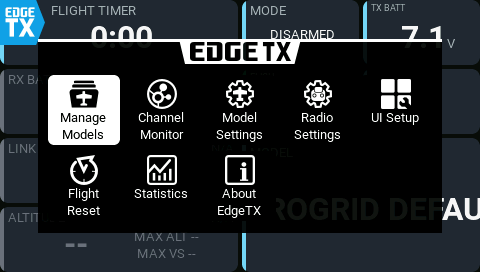

Select the **+** tab, then tap **Add Screen**.

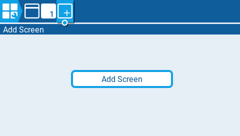

On the new screen, tap the **Layout** thumbnail and choose **App mode**.
This makes one widget fill the screen.

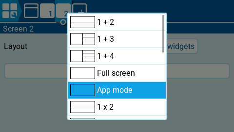

Tap **Setup widgets**, then tap the empty widget area.

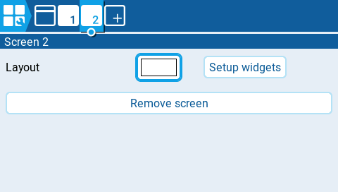

Choose **AeroGrid** in **Select widget**.

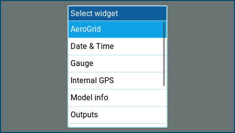

In the AeroGrid settings, choose **Layout**. Select **Empty** to build your
own dashboard, or **Default** to start with the bundled aircraft dashboard.
Choose **Modern Dark** or **Modern Light** for **Theme**.

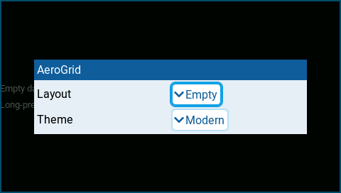

Press **RTN** to close the settings and leave setup. Your dashboard is now
on the new screen. Repeat these steps to add another dashboard.

## Understand layouts

A **dashboard** is AeroGrid on a radio screen. A **layout** defines its panels,
their positions and sizes, and their settings, including sources and alarms.
Choose a layout to decide what that dashboard displays.

| Layout | Purpose |
| --- | --- |
| **Empty** | A blank starting point for your own dashboard. Shows instructions until you start editing. |
| **Default** | A ready-made aircraft dashboard. Configure its sources, switches, battery cell count, and alarms for your model before using it. |
| **Diagnostics** | A diagnostics dashboard for checking loaded components and errors. |
| **Palette** | Fixed theme samples: color tokens, text, bars, a dial, and every panel state. Not flight data. |

Bundled layouts are stored in `/WIDGETS/AeroGrid/layouts/`. Your saved layouts
are stored separately in `/AEROGRID/layouts/`, so upgrading AeroGrid leaves
them untouched.

**Save** updates the current layout. For a bundled layout it creates your
copy in `/AEROGRID/layouts/` under the same name, leaving the bundled original
untouched.
**Save as...** creates a separately named layout.

Several dashboards, even on different models, can select the same layout.
They share all panel settings, so check that the sources and switches suit
each model. Saving changes under that name affects all dashboards using it
when they next reload.

Restart the radio after saving a new name so it appears in the **Layout**
picker. A missing layout falls back to **Default**.

## Edit a dashboard on the radio

1. Long-press the dashboard to enter fullscreen. The EdgeTX logo in the
   top-left corner disappears.
2. In fullscreen, long-press a panel again to start editing.
   **Enter** also starts editing. A **gear**
   icon appears in the top-right corner of each panel.

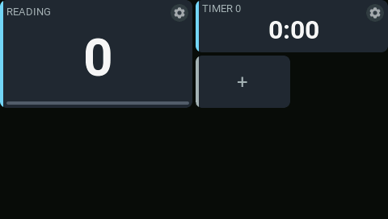

| Action | How |
| --- | --- |
| Add | Tap the **+ panel**, then choose a panel type. Its settings open automatically. |
| Move | Drag the panel's body to a free position. |
| Reorder | Drag onto another panel. Compatible panels exchange positions or order; other panels stay put. |
| Resize | Drag the top-left, bottom-left, or bottom-right corner. The opposite corner stays fixed. |
| Configure | Tap the **gear** in the top-right corner. |
| Remove | Open the gear, then choose **Remove panel**. Removal is immediate. |

Panels snap to the 4 × 4 layout grid. Moves and sizes must fit without
overlapping other panels. The **+ panel** disappears when there is no free
cell. There are no grid lines or resize handles: drag the corners directly.
Moving and resizing require touch.

Use the native choices, toggles, number controls, and text keyboard in the
settings dialog. Sources, switches, and timers use EdgeTX pickers.

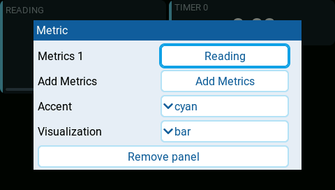

Metrics and State entries appear as named rows with a summary of their settings.
Tap a row to edit it, or tap the full-width **+** row to add an entry.
In a metric entry, choose **Source** to change the reading.

In a State entry, open a state to edit **When**, **Text**, and **Background**.
The first true condition wins. Each entry supports up to three conditions;
**+** appends one at the bottom. Delete and recreate a condition to change
its priority. Background choices are **normal**, **active**, **warning**, and
**critical**. The main entry's winning choice sets the whole panel's appearance,
including its background, sidebar, text colors, and badge. Supporting entries
never change the panel mode.

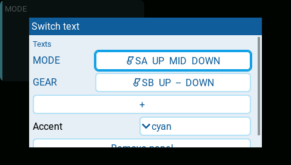

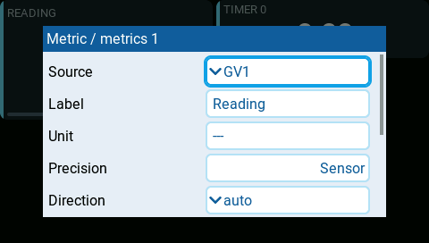

Press **RTN** or tap outside a dialog to return one level. Changes remain in
your draft.

From the editing dashboard, press **RTN**. If nothing changed, editing closes.
Otherwise choose an action:

| Action | Result |
| --- | --- |
| **Save** | Updates the current layout and exits editing. |
| **Save as...** | Asks for a name and saves a separate layout. |
| **Discard changes** | Exits editing and restores the saved layout. |

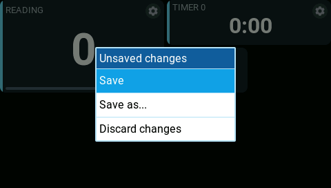

Save As suggests the model name plus the first unused number, such as
`Sonic1`. You can change it using letters, digits, `-`, and `_` (at most
24 characters). An existing name requires overwrite confirmation.
Press **RTN** in the name dialog to return to the exit menu without losing
your draft.

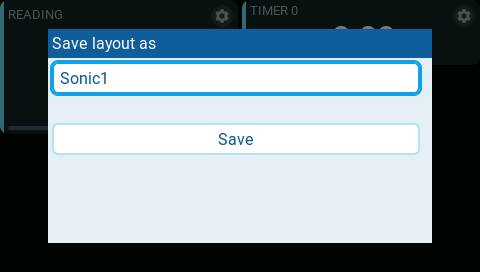

**After Save As, restart the radio and select the new name in the widget's
Layout setting.** The widget cannot change its own settings, so it continues
showing its previous layout until you select the new one.

Wait for saving to finish before powering off. A save error keeps your draft
so you can retry; the previous saved file is retained as `.bak`.

## App mode and Full screen

| Layout | What you see |
| --- | --- |
| **App mode** | A dashboard covering the display, without the EdgeTX top bar, flight-mode label, sliders, or trims. The menu button remains in the top-left corner. |
| **Full screen (`1 x 1`)** | One dashboard widget, with the option to keep EdgeTX's top bar, flight-mode label, sliders, and trims. |

Use App mode for a clean dashboard, or Full screen to keep the radio's
standard information alongside it. In App mode, a wider top-left panel
leaves more room beside the menu button.

## Choose a theme

Choose **Theme** in the widget settings.

| Mode | Behavior |
| --- | --- |
| **Modern Dark** | AeroGrid's dark instrument palette. |
| **Modern Light** | Pale instrument panels, dark text, and light-background accents and alarm tints. |

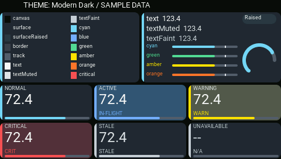

*Modern Dark palette.*

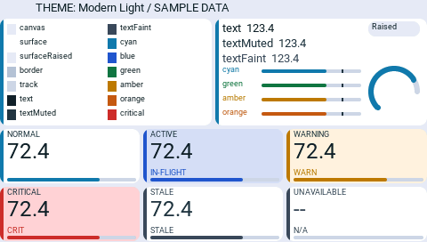

*Modern Light palette. Accents, including critical red, are darker for light backgrounds.*

## Customize themes

Themes are stored as individual `.yml` files. Shipped themes live in
`/WIDGETS/AeroGrid/themes/`; add user themes to `/AEROGRID/themes/`. Theme names
are the filename stems, and user files override shipped files with the same
name. AeroGrid updates the Theme picker registry automatically; do not edit
`/AEROGRID/theme-registry.txt`. Use the **Palette** layout to preview palettes
against fixed samples before applying one to a dashboard.

Select **Palette** as the layout on a separate App-mode screen. It shows the
actual AeroGrid theme and rendering primitives with fixed sample data, without
a receiver or telemetry setup. Switch the widget's **Theme** option between
Modern Dark and Modern Light to compare the same samples. Normal, active,
warning, critical, stale, and unavailable cards are shown together.

Copy one complete file from `/WIDGETS/AeroGrid/themes/` to
`/AEROGRID/themes/<name>.yml`. Set `name` to the filename stem and provide a
`label` and `version: 1`. Define every color token and spacing value; themes do
not inherit from one another. Colors use `0xRRGGBB`, such as `0xFFFFFF` for
white and `0x000000` for black. `accent` selects the default semantic accent
(`cyan`, `green`, `amber`, or `orange`). Put all color values, including optional `warningBg`,
`criticalBg`, and `activeBg` panel-surface backgrounds, in the `colors:` section.
`light` and `tintSeparation` tune light-theme alert surfaces.
`correctForContrast` controls automatic legibility adjustments; it defaults to
`true`. Set it to `false` to preserve the specified palette values. Use spaces
for YAML indentation, not tabs.

Contrast safeguards may adjust a color to preserve legibility. Review the
palette on the **Palette** layout and on the radio as well as in the simulator.
Restart the radio or simulator after adding a theme so the picker reloads.

## Troubleshoot a reading

If a panel shows no reading or an unexpected value:

1. Open the panel's settings using its **gear** icon while editing. If it has
   a **Source** setting, check that you selected the value you want to display.
2. For a telemetry reading, check that the receiver is connected and the
   sensor appears on the radio's **Telemetry** page.
3. Check the guide for that panel for any additional setup:
   [battery](../panels/cell-battery.md),
   [timer](../panels/flight-timer.md),
   [navigation](../panels/navigation.md), or
   [metric](../panels/metric.md).

A missing reading does not mean the value is zero.
